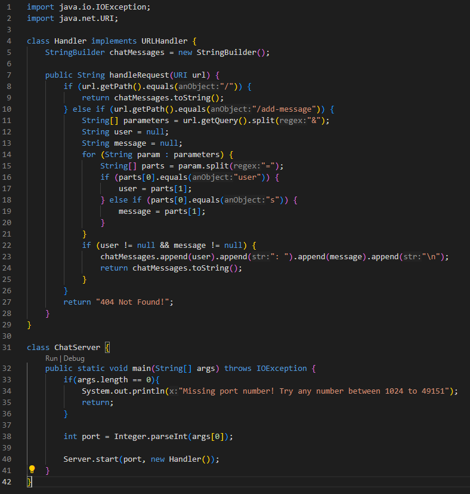
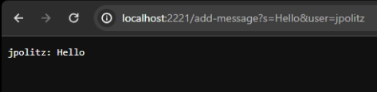
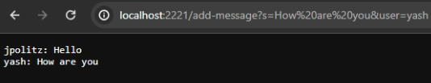

# Lab Report 2

## Part 1
**Code for `ChatServer.java`**

 

**Using `add-message`**

The method being called is `handleRequest(URI url)`.

The argument to the handleRequest method is URI, which represents the URL of the request. The handleRequest method receives `/add-message?s=Hello&user=jpolitz` which is the request. The path is `/add-message` and the query `s=Hello&user=jpolitz`.

The value of `chatMessages` changes since prior to the request, it was an empty string. After the request, the value of `chatMessages` is `"jpolitz:Hello\n"`  

 

**Using `add-message` again**

The method being called is `handleRequest(URI url)`.

The argument to the handleRequest method is URI, which represents the URL of the request. The handleRequest function receives `/add-message?s=How are you&user=yash` which is the request. The path is `/add-message` and the query `s=How are you&user=yash`.

The value of `chatMessages` changes since prior to the request, it was `"jpolitz:Hello\n"`. After the request, the value of `chatMessages` is `jpolitz: Hello\nyash: How are you\n`  

## Part 2

## Part 3
In week 2's lab, I learned how to build and run a server through the terminal. I had not known before the lab that this was even a possibility, and it turned out to be a lot simpler than I would have believed. I also learned how to use curl, which allowed me to access URLs from the command line.
